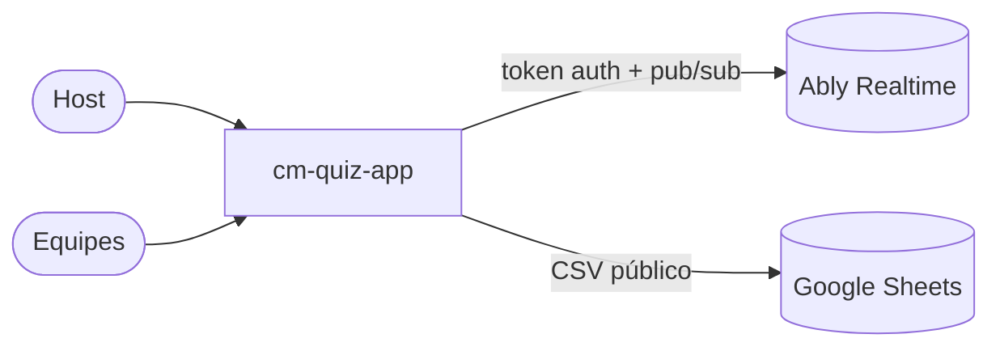
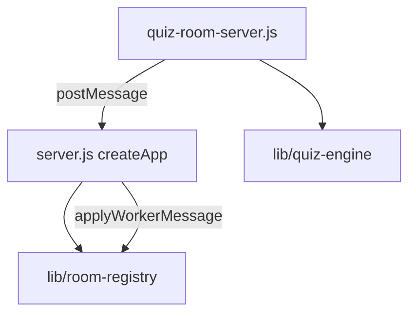

# Arquitetura — cm-quiz-app

## 1. C4

### Contexto



### Contêineres

| Contêiner | Tecnologia | Responsabilidade |
|---|---|---|
| Front | Vue 2 + Vue Router (build em `realtime-quiz/dist`) | Telas de host e jogador |
| Servidor principal | Node 20 + Express (`server.js`) | Estático, `/auth`, `/checkRoomStatus`, `/health`, cria *workers* |
| Worker por sala | `worker_threads` (`quiz-room-server.js`) | Fluxo da sala e pontuação |
| Mensageria | Ably | Canais `<sala>:primary` e por jogador |

### Componentes do servidor



## 2. Pastas

```
server.js                 createApp({realtime, registry}) + main()
quiz-room-server.js       worker de cada sala
quiz-default-questions.js perguntas padrão (gabarito 0-based)
lib/quiz-engine.js        normalizeCustomQuestion, createScoreboard (puro)
lib/room-registry.js      createRoomRegistry, applyWorkerMessage (puro)
tests/quiz.test.js        node:test + supertest
realtime-quiz/            front Vue 2
```

## 3. Modelo de dados (em memória)

| Entidade | Campos | Regra |
|---|---|---|
| Sala | `code`, `isClosed`, `totalPlayers`, `totalPlayersThroughout` | Atualização por *merge*; fecha ao iniciar |
| Pergunta | `question`, `choices[2..4]`, `correct` (0-based), `imgLink?` | Validada por `normalizeCustomQuestion` |
| Placar | `clientId → {nickname, score}` + respondidos por pergunta | 1 resposta por jogador por pergunta, só com pergunta aberta; 5 pontos por acerto |

## 4. Contratos HTTP

| Rota | Resposta |
|---|---|
| `GET /health` | `200 {status:"ok", rooms, ...}` |
| `GET /auth` | `200` token Ably (clientId `randomUUID`, TTL 1 h) · `502` se a Ably falhar |
| `GET /checkRoomStatus?quizCode=` | `200 {isRoomClosed}` · `400` código fora do padrão |
| `GET /`, `GET /play` | `index.html` do build |

## 5. ADRs

- **ADR-001 — Comando de host validado por `clientId`.** O `clientId` vem do token emitido pelo servidor, então não pode ser forjado pelo cliente. Mitiga D3 sem mudar o front. Limite conhecido: o token ainda tem capability ampla em todos os canais; restringir por sala exige passar o código da sala no `/auth` (próximo ciclo).
- **ADR-002 — Regras puras em `lib/`.** Pontuação e registro sem Ably e sem thread, testáveis em milissegundos.
- **ADR-003 — `createApp` injetável e `main()` só quando executado direto.** Permite testar rotas com supertest usando uma Ably falsa.
- **ADR-004 — Migração Vue 2 → Vue 3/Vite adiada.** Vue 2 está EOL; migração é um projeto próprio (reescrita de 9 componentes). Registrado como risco.

## 6. Fora do escopo

Migração para Vue 3/Vite; acessibilidade do front; persistência de resultados; capability Ably por sala; autenticação de host com senha.
